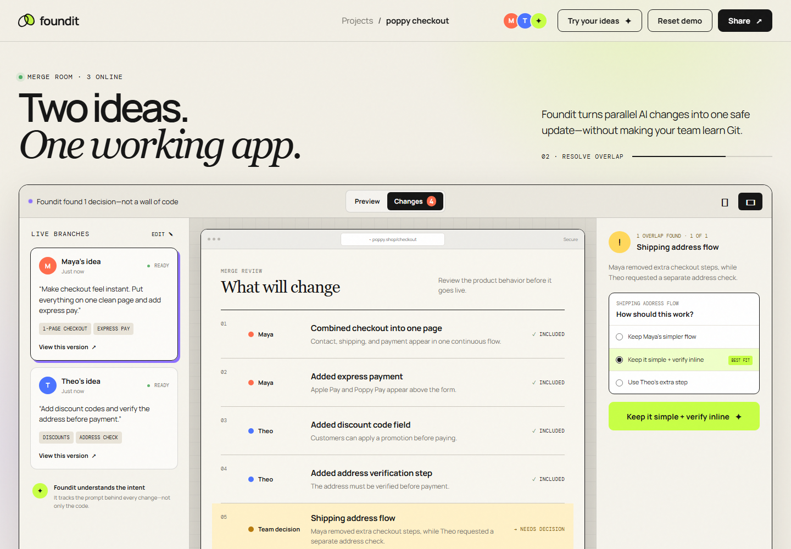
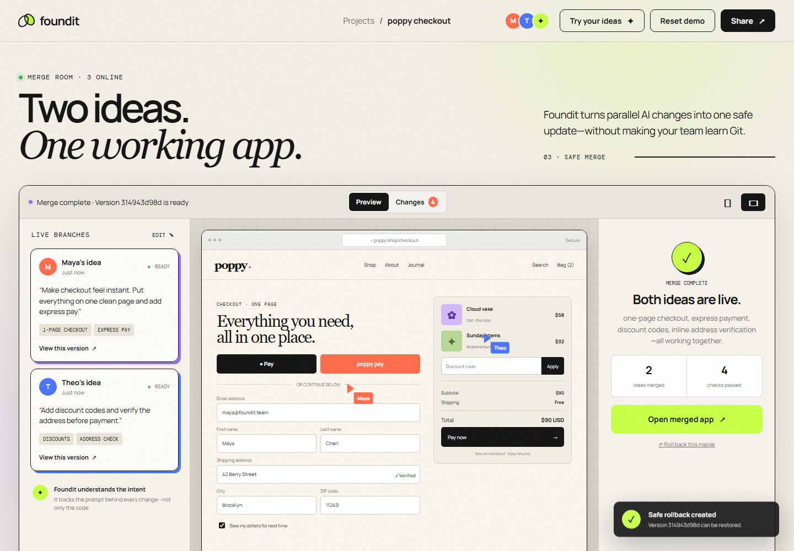

# Foundit

**Multiplayer safety for vibe coding.**

Foundit helps teammates combine AI-generated product changes without forcing them to understand Git or resolve conflicts line by line.

Two teammates describe what they want in normal language. Foundit creates an independent version for each idea, explains the customer-facing changes, detects incompatible behavior, asks the team for one clear decision, and produces a checked, reversible result.



## The problem

AI coding tools make it easy for one person to build quickly, but collaboration is still designed around files, branches, and code diffs. Two individually valid AI requests can create an incompatible product even when they never edit the same line of code.

Foundit treats **intent** as the unit of collaboration. It shows teams what each person is trying to change and where those intentions disagree.

## How it works

1. Two teammates describe their changes in normal language.
2. Foundit creates a separate product version for each request.
3. The team previews both versions and reviews what will change.
4. Foundit detects direct and semantic conflicts between the requested behaviors.
5. The team chooses a product outcome instead of resolving code manually.
6. Foundit merges the approved behavior, runs safety checks, and creates a rollback version.

## Demo scenario

Maya asks for a one-page checkout with express payment. Theo simultaneously asks for discount codes and address verification.

Both ideas work independently, but they disagree about the checkout flow: Maya removes additional steps while Theo introduces a separate verification step. Foundit identifies the conflict and recommends verifying the address inline, preserving the intent behind both requests.

The resulting checkout includes:

- One-page checkout
- Express payment
- Discount codes
- Inline address verification
- A deterministic rollback point



## Functional MVP

The current intent engine understands checkout requests involving:

- One-page and multi-step layouts
- Express payment
- Discount, promotion, and coupon codes
- Inline, separate, and removed address verification
- Guest checkout and required accounts
- Order notes and delivery instructions
- Gift messages

Unsupported requests are identified instead of silently producing invented behavior.

## Architecture

Foundit is built as a focused vertical slice with three layers:

### Intent engine

Converts supported natural-language requests into structured product behavior while preserving the teammate and prompt behind each change.

### Conflict and merge engine

Compares both requested configurations, detects direct and semantic conflicts, offers possible resolutions, and generates a deterministic merged configuration.

### Interactive review interface

Lets teams enter ideas, preview versions, review customer-facing changes, resolve conflicts, inspect the merged product, and roll back the result.

## Built with

- JavaScript
- Node.js
- HTML5
- CSS3
- REST APIs
- Node Test Runner
- Chrome DevTools Protocol

The functional prototype does not require a database or a generative AI API at runtime.

## Testing

The project includes 14 automated tests covering:

- Natural-language behavior extraction
- Compatible and incompatible teammate requests
- Recommended and explicit conflict resolutions
- Merged configuration and rollback generation
- API health, analysis, merge, and validation behavior
- Static-file security
- A complete headless-browser journey from custom ideas through merge and reset

Run the complete test suite with:

```bash
npm test
```

## Current scope

Foundit currently proves the collaboration workflow through a real structured checkout configuration. It does not yet inspect arbitrary repositories, write production source code, or push approved merges to GitHub.

The next milestone is a repository adapter that connects prompt history and code changes to the same intent model, runs proposed versions in isolated environments, and opens a tested pull request after approval.

## Vision

Foundit aims to become the collaboration layer between people, coding agents, and production software.

**Two teammates. Two AI workflows. One working app.**
